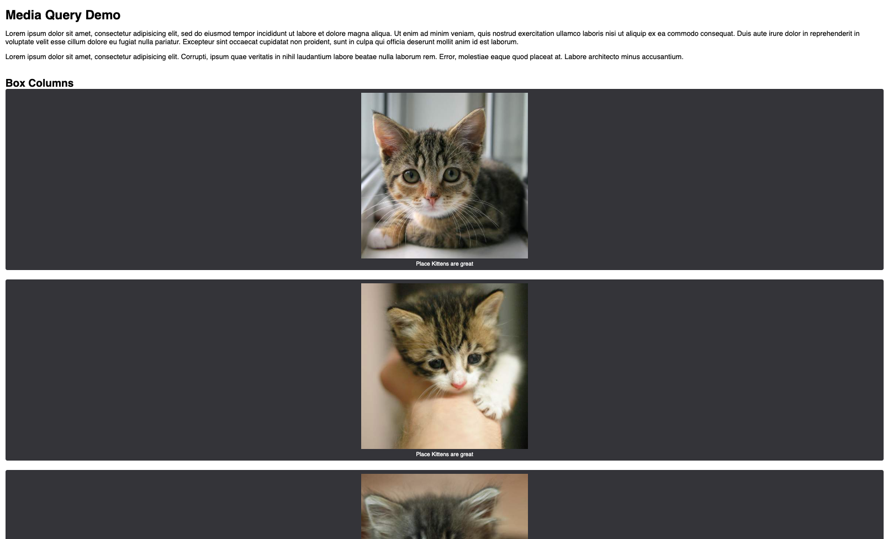
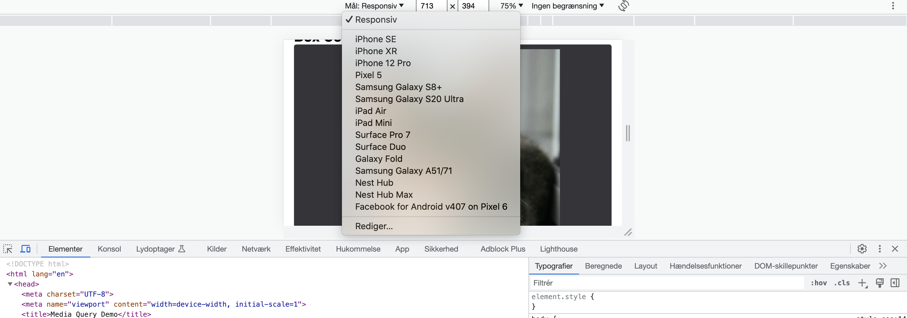

# Media Query Exercise

## What is CSS breakpoints

A breakpoint is simply a point at which we're defining that the design should change.
Since CSS breakpoints for responsive design are implemented with media queries, they are also sometimes termed media query breakpoints.

## Installation

Download/clone this repo to your machine (Mac / Win).
Next open the **style.css** inside the folder **css** file from the repository that you downloaded above with your editor Visual Studio Code. Follow the the instructions below.

## Result before adding CSS breakpoints



### Create a CSS breakpoint (794px)

Open the **style.css** file inside the folder **css** with your editor.
Next scroll down to the end of the style.css file and add a new media query breakpoint in your style.css file using the min-width media feature. Set the min-width to 794px. Within this breakpoint, change your CSS to do the following:

**Here is an example of media query:**

```css
@media screen and (min-width: 794px) {
}
```

**Inside the newly added media query breakpoint change following selectors:**

- Set the CSS background property in the **body** element to **#0000ff33**

- Set the **margin** property in the **body** element. Set top and bottom **margin** to 25px and left and right **margin** to 6%.

- Set the CSS **float** property in the **figure** element to **left**

- Set the **width** property in the **figure** element to **45%**

- Set **right margin** property in the **figure** elemet to **4.5%**

#### Test your CSS breakpoint in Google Dev Tools

Open Google Dev Tools by Right-clicking on the page > Inspect
In the top Menu click on > Responsive Design Mode. <br>
Now try to resize the browser windows and see the changes.



### Create another CSS breakppint (1020px)

Add a new media query breakpoint in your style.css file using the min-width media feature. Set the min-width to 1020px. Within this breakpoint, change your CSS to do the following:

**Inside this media query change following selectors:**

- Set the CSS **background** property in the **body** element to **#00ff0033**
- Set the **margin** property in the **body** element. Set top and bottom margin to **25px** and left and right margin to **10%**.

- Set the **max-width** property in the **body** element to **1600px**.

- Set the CSS width property in the figure element to **30%**

- Set the **right margin** property in the figure elemet to **2.5%**

#### Test your CSS breakpoint in Google Dev Tools

Open Google Dev Tools by Right-clicking on the page > Inspect
In the top Menu click on > Responsive Design Mode. <br>
Now try to resize the browser windows and see the changes.

### Create another CSS breakppint (1200px)

Add a new media query breakpoint in your **style.css** file using the min-width media feature. Set the min-width to 1200px. Within this breakpoint, change your CSS to do the following:

**Inside the media query above change following selectors:**

- Set the CSS background property in the **body** element to **#00f7ff33**

- Set the margin property in the **body** element. Set top and bottom margin to 20px and left and right margin to 10%.

- Set the **max-width** property in the **body** element to **1600px**.

- Set the width property in the figure element to **22%**

- Set the right margin property in the figure elemet to **2.5%**

#### Test your CSS breakpoint in Google Dev Tools

Open Google Dev Tools by Right-clicking on the page > Inspect
In the top Menu click on > Responsive Design Mode. <br>
Now try to resize the browser windows and see the changes.

### Create another CSS breakppint (1500px)

Add a new media query breakpoint in your **style.css** file using the min-width media feature. Set the min-width to 1500px. Within this breakpoint, change your CSS to do the following:

**Inside the media query above change following selectors:**

- Set the CSS background property in the **body** element to **#b00c6c33**

- Set the margin property in the **body** element. Set top and bottom margin to **20px** and left and right margin to **10**.

- Set the **max-width** property in the **body** element to **1600px**.

- Set the width property in the figure element to **18%**

- Set the right margin property in the figure elemet to **2.5%**

#### Test your CSS breakpoint in Google Dev Tools

Open Google Dev Tools by Right-clicking on the page > Inspect
In the top Menu click on > Responsive Design Mode. <br>
Now try to resize the browser windows and see the changes.
